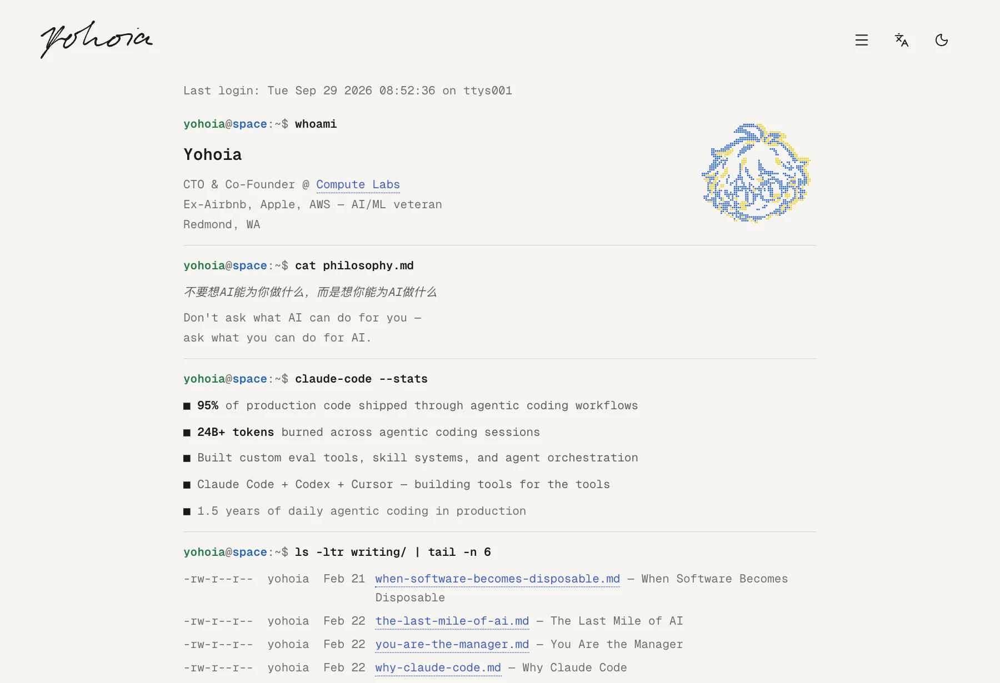

<picture>
  <source media="(prefers-color-scheme: dark)" srcset="./assets/readme/logo-dark.svg">
  
</picture>

# Yohoia · Blog

> 安静地记录，认真地探索。

基于 **Astro** 的个人数字空间，用来整理文章、碎片笔记、项目与发现。暖纸色主题、克制的排版，以及中英文共用的页面结构。

[快速开始](#快速开始) · [当前进度](#当前进度) · [项目结构](#项目结构) · [技术与设计](#技术与设计)

<picture>
  <source media="(max-width: 600px) and (prefers-color-scheme: dark)" srcset="./assets/readme/index-mobile-dark.webp">
  <source media="(max-width: 600px)" srcset="./assets/readme/index-mobile-light.webp">
  <source media="(prefers-color-scheme: dark)" srcset="./assets/readme/index-dark.webp">
  
</picture>

_当前首页的真实截图。介绍逐字播放，内容直接在页面中向下展开。_

## 当前进度

已完成中英文 **Index** 与 **Writing 列表**，对应 `/`、`/en/`、`/writing/`、`/en/writing/` 四个静态页面。

- **公共导航**：Logo 与操作按钮分置视口两侧，保留响应式边距与滚动收紧。桌面和移动端统一使用语言按钮前的菜单图标，打开黑色全屏 Type Overlay：从按钮位置圆形展开，七个栏目以大字号依次进入，悬浮或聚焦时向右移动。支持关闭按钮、Escape、焦点约束与阅读位置恢复，减少动画时直接显示；禁用 JavaScript 时仍可使用折叠菜单。首页、Writing 与菜单隐藏滚动条外观，保留滚轮、触控和键盘滚动；开关菜单时保持页面宽度与吸顶导航位置稳定。
- **中英切换**：保留查询参数、锚点、主题和阅读位置，减少翻译长度导致的布局变化；历史前进与后退恢复各自记录的阅读位置。
- **栏目过渡**：全屏菜单切换不同栏目，以及 Header Logo 从其他页面返回首页时，播放同一 ASCII 字符过渡：随机字符成片铺满屏幕，覆盖后交换页面，再逐格退场，填充与退场各约 0.5 秒。沿用当前明暗主题；语言切换、正文链接、当前栏目与历史返回不播放。减少动画或不支持 Popover 时使用普通跳转，动画结束后停止绘制并释放画布。
- **手写 Logo**：刷新时播放一次，悬浮或键盘聚焦时重播；遵循系统减少动画偏好。
- **平铺首页**：介绍在页面中居中排布，正文左对齐，各部分以细横线和紧凑间距分隔；绿色用户名、蓝色主机名和柔和绿色光标，Motion 驱动匀速逐字输入与逐行淡入。内容区从顶部导航栏下沿开始排布。仅刷新自动播放，直接访问、站内返回与历史返回显示完整内容；播放结束后，末尾空提示符的绿色光标继续闪烁，移出视口或页面进入后台时暂停。访问时间读取浏览器本地时间，语言切换保留当前播放进度和阅读位置，减少动画模式直接展示完整内容。
- **像素头像**：`whoami` 右侧展示由个人头像生成的圆点图像，与左侧信息同步聚合；桌面端根据完整文字高度调整大小，手机端使用更小尺寸。悬浮、聚焦或点击可重播，语言切换保留进度，减少动画或禁用 JavaScript 时显示完整静态 SVG。
- **内容基础**：Markdown / MDX、Content Collections、字段校验、草稿过滤和统一内容路径。
- **错误页面**：403、404、500、502 使用独立的全屏布局，不显示 Header；插图和说明在整个视口中居中，继承站点明暗主题，按 URL 显示中英文并提供返回首页入口。

首页姓名与联系方式已使用 Yohoia 的信息。`pr -2 -t links.md` 按两列显示八个渠道：左侧 Email（`imyohoia@gmail.com`）、QQ、X、小红书，右侧 Bilibili、GitHub、微信（`13870096885`）与 Telegram（`@Yohoia`）。微信入口复制号码，TG 跳转至 `https://t.me/Yohoia`；渠道、标签及目标集中在 `src/config/site.ts`，品牌 SVG 在本地托管，沿用单色图标与文本链接样式，刷新播放时按行展示两列。其余公司、履历与统计按用户要求暂留参考稿内容，集中在 `src/features/index/config.ts` 等待替换。文章区使用 `yohoia@space:~$ ls -ltr writing/ | tail -n 6`，从 Writing 共用的参考列表取最新 6 条，保留从旧到新的输出顺序；`Writing — full blog` 进入本站对应语言的完整列表，文件名定位到列表条目。9 条参考文章集中在 `src/features/writing/config.ts`，目前尚无正文或文章详情页。

Fragments、Projects、Finder、News、Now 已预留结构，栏目页与详情页仍待制作。主导航保留计划路径，尚未实现的地址显示自定义 404 页面。内容集合为空，Writing 目前展示用户提供的参考记录；News 数据源与公开 RSS 端点尚未接入。

## 快速开始

使用 **Node.js 24 LTS** 和 npm。锁文件保存精确依赖版本，推荐用 `npm ci` 安装。

```sh
git clone https://github.com/Yohoia/blog.git
cd blog
npm ci
npm run dev
```

打开开发服务器输出的地址，默认是 `http://localhost:4321`。

| 命令                   | 用途                     |
| ---------------------- | ------------------------ |
| `npm run dev`          | 本地开发                 |
| `npm run check`        | Astro 与 TypeScript 检查 |
| `npm run build`        | 类型检查并生成 `dist/`   |
| `npm run preview`      | 预览生产构建             |
| `npm run format:check` | 检查代码格式             |
| `npm run format`       | 格式化源码与项目文档     |

正式域名确定后，复制 `.env.example` 为 `.env`，填写 `SITE_URL`。留空也能开发和构建；配置后才启用 Sitemap 与 Canonical / hreflang。静态托管使用 `npm ci` 安装、`npm run build` 构建、`dist/` 发布。

### 错误页与部署路由

| 状态码 | 中文预览路径 | 英文预览路径 | 静态产物              |
| ------ | ------------ | ------------ | --------------------- |
| 403    | `/403/`      | `/en/403/`   | `dist/403/index.html` |
| 404    | `/404/`      | `/en/404/`   | `dist/404.html`       |
| 500    | `/500/`      | `/en/500/`   | `dist/500.html`       |
| 502    | `/502/`      | `/en/502/`   | `dist/502/index.html` |

八个入口共用 `src/features/errors/ErrorPage.astro`，文案位于同目录的 `config.ts`，仅在服务端使用的图片映射位于 `images.ts`；原始 PNG 保留在 `public/images/`，页面使用 Astro 构建生成的响应式 WebP。错误页标记 `noindex`，并从 Sitemap 排除。英文产物均位于 `dist/en/<状态码>/index.html`。

站内链接继续使用尾部斜杠，路由匹配允许两种写法，避免生产预览在无斜杠的未知地址上提前返回 Astro 默认错误页。

Astro 开发服务器会将未知地址交给 `src/pages/404.astro`，静态构建生成根目录的 `404.html`；托管平台须把找不到的请求交给这份文件并保留 HTTP 404。静态托管共用根错误文件时，浏览器脚本根据实际 URL 的 `/en/` 前缀同步文案和返回首页链接；无 JavaScript 时根文件显示默认中文，显式英文路由仍正常显示英文。参见 [Astro 错误页文档](https://docs.astro.build/en/basics/astro-pages/#custom-404-error-page)。

当前采用静态输出，访问错误页地址用于预览；线上真正的 403、500、502 由服务器或代理产生，需要在对应服务绑定这些 HTML。尚未选择部署平台，因此不添加平台适配器。使用 Nginx 时可在静态站点的 `server` 块中引入 [`deploy/nginx-errors.conf`](deploy/nginx-errors.conf)，并把 `root` 指向 `dist`；反向代理还需在页面请求所在的 `location` 配置 `proxy_intercept_errors on`。这是待部署时启用的示例，参见 [Nginx error_page 文档](https://nginx.org/en/docs/http/ngx_http_core_module.html#error_page)。

## 技术与设计

**Astro 7 · TypeScript 6 · Tailwind CSS 4 · Motion · Lucide**

页面与公共 UI 优先使用 Astro 组件，React Islands 留给需要复杂交互的模块。内容在构建时生成静态 HTML；不依赖数据库或 CMS。MDX、SEO、Sitemap 与 RSS 工具已接入基础层，目录职责见 [项目结构](#项目结构)。

视觉规范来自 [design.md](design.md)：公共颜色、字号、间距和容器集中在 Design Tokens，组件与正文复用同一套样式。首页采用透明的平铺内容，沿用公共明暗主题与阅读宽度。Geist Sans / Mono 在本站托管，中文采用系统字体回退。动画参数集中配置，明暗主题与语言沿用公共脚本。

全屏菜单使用 `src/components/layout/TypeOverlayMenu.astro` 与 `src/scripts/type-overlay-menu.ts`，由原生 `dialog` 管理模态焦点和背景交互，Motion 驱动圆形展开、逐项进入与悬浮动画。菜单按实际视口尺寸覆盖全屏，避免滚动条占位缩小 `100vw`。布局使用 Tailwind，颜色和字号位于公共 Token，时序位于 `motionTokens.menu`，不增加依赖。关闭、离开页面或语言切换时释放滚动锁并清理动画，避免影响原有阅读位置。

栏目过渡使用 `src/components/common/NavigationTransition.astro` 与 `src/scripts/navigation-transition.ts`。Motion 时钟驱动 Canvas 字符网格，原生顶层 Popover 覆盖菜单；Astro ClientRouter 在完全覆盖后交换页面，并持久化同一画布，让退场延续当前字符。参数集中在 `motionTokens.navigationTransition`，包含时长、网格大小、帧率与格子数量上限；等待页面加载时保持覆盖，超时回退普通跳转，不增加依赖。

像素头像原图与静态 SVG 位于 `src/assets/images/`，组件为 `src/features/index/PixelAvatar.astro`。`src/scripts/pixel-avatar.ts` 使用一个 Motion 时钟驱动 Canvas，完成后停留在最后一帧，不再循环或切换绘制方式；SVG 用于静态访问、减少动画与无脚本显示。完整文字提前保留高度，头像在开始聚合前确定尺寸，避免最后一行出现时缩放抖动。配色读取公共 Token，聚合参数集中在 `motionTokens.avatar`，不增加运行时依赖。

## 项目结构

```text
src/
├── pages/            # 精简的路由入口
├── layouts/          # 文档、SEO、主题与公共导航
├── features/         # 各板块的页面、组件与业务逻辑
├── components/       # 跨板块复用的 Astro 组件
├── content/          # Markdown / MDX 与结构化内容
├── lib/              # 查询、Schema、路径与 RSS 工具
├── config/           # 站点、导航、语言与动画配置
├── i18n/             # 公共界面翻译字典
├── scripts/          # 浏览器交互
├── styles/           # Design Tokens、组件与正文样式
├── assets/           # 构建处理的品牌资源
└── islands/          # React 交互模块预留
```

路由组合 `features`、布局和公共组件；板块模块调用 `lib` 与 `config`，基础层不反向依赖页面。默认中文不加前缀，英文使用 `/en/`；首页与 Writing 各维护一份版式。内容标题与正文保留原文，内容级翻译仍需真实译文。

<details>
<summary>常用配置入口</summary>

| 配置                 | 文件                                                                                                      |
| -------------------- | --------------------------------------------------------------------------------------------------------- |
| 站点信息与联系方式   | [`src/config/site.ts`](src/config/site.ts)                                                                |
| 语言、导航与公共翻译 | [`i18n.ts`](src/config/i18n.ts) · [`navigation.ts`](src/config/navigation.ts) · [`ui.ts`](src/i18n/ui.ts) |
| 板块文案与参考文章   | [`index/config.ts`](src/features/index/config.ts) · [`writing/config.ts`](src/features/writing/config.ts) |
| 设计与动画参数       | [`tokens.css`](src/styles/tokens.css) · [`motion.ts`](src/config/motion.ts)                               |
| 内容模型与分类       | [`schemas.ts`](src/lib/content/schemas.ts) · [`categories.ts`](src/config/categories.ts)                  |

</details>

## 继续构建

- [公共设计规范](design.md)：视觉主题、排版与交互规范。
- [内容模型](src/lib/content/schemas.ts)：内容字段与校验规则。
- [AGENTS.md](AGENTS.md) / [CLAUDE.md](CLAUDE.md)：AI 编程协作入口。

下一步是逐步制作其余栏目页，并加入真实内容。当前尚未部署站点，也未指定开源许可证。
