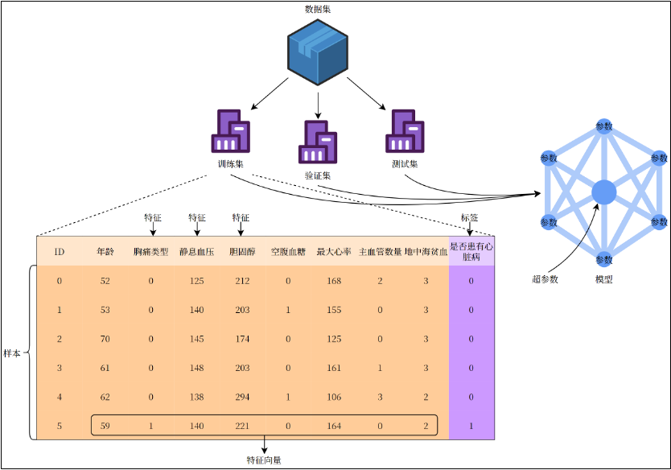
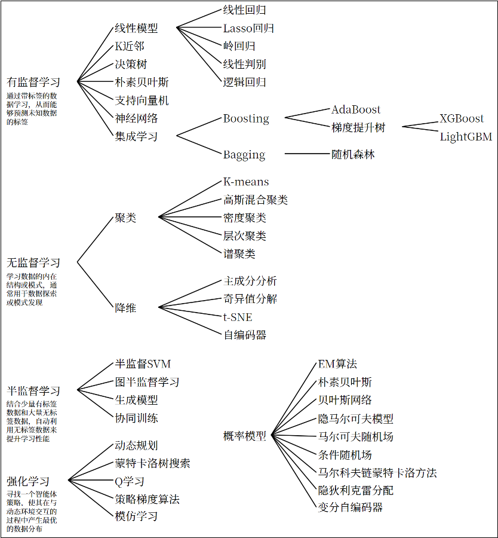
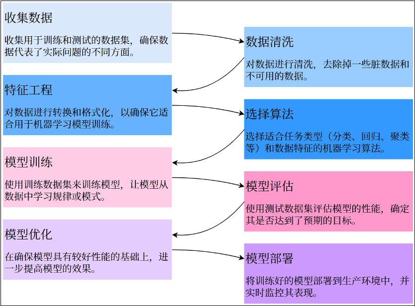

**机器学习**（Machine Learning, ML）主要研究计算机系统对于特定任务的性能，逐步进行改善的算法和统计模型。通过输入海量训练数据对模型进行训练，使模型掌握数据所蕴含的潜在规律，进而对新输入的数据进行准确的分类或预测。

机器学习是一门多领域交叉学科，涉及概率论、统计学、逼近论、凸优化、算法复杂度理论等多门学科。

## 1.1 基本术语

- **数据集（Data Set）**：多条记录的集合。

  - **训练集（Training Set）**：用于训练模型的数据。
  - **验证集（Validation Set）**：用于调节超参数的数据。
  - **测试集（Test Set）**：用于评估模型性能的数据。

- **样本（Sample）**：数据集中的一条记录是关于一个事件或对象的描述，称为一个样本。
- **特征（Feature）**：数据集中一列反映事件或对象在某方面的表现或性质的事项，称为特征或属性。
- **特征向量（Feature Vector）**：将样本的所有特征表示为向量的形式，输入到模型中。
- **标签（Label）**：监督学习中每个样本的结果信息，也称作目标值（target）。
- **模型（Model）**：一个机器学习算法与训练后的参数集合，用于进行预测或分类。
- **参数（Parameter）**：模型通过训练学习到的值，例如线性回归中的权重和偏置。
- **超参数（Hyper Parameter）**：由用户设置的参数，不能通过训练自动学习，例如学习率、正则化系数等。

## 1.2 机器学习基本理论

### 1.2.1 机器学习三要素

机器学习的方法一般主要由三部分构成：模型、策略和算法，可以认为：

_**机器学习方法 = 模型 + 策略 + 算法**_

- 模型（model）：总结数据的内在规律，用数学语言描述的参数系统
- 策略（strategy）：选取最优模型的评价准则
- 算法（algorithm）：选取最优模型的具体方法

### 1.2.2 机器学习方法分类

- 常见分类（按照有无监督）

  - 有监督学习：输入数据是由输入特征值和目标值所组成，即输入的训练数据有标签**（Label）**的。

    - 分类问题：目标值（标签值）是不连续的
    - 回归问题：目标值（标签值）是连续的

  - 无监督学习：输入数据没有被标记，即样本数据类别未知，没有标签，根据样本间的相似性，对样本集**聚类**，以发现事物内部结构及相互关系。
  - 半监督学习：输入数据有特征，有部分标签。
  - 强化学习：通过与环境交互并获取延迟返回进而改进行为的学习过程

- 按模型分类：根据模型性质，可以分为概率模型/非概率模型，线性/非线性模型等。
- 按学习技巧分类：根据算法基于的技巧，可以分为贝叶斯学习、核方法等。

### 1.2.3 各种类型的机器学习方法

### 1.2.4 建模流程

## 1.3 特征工程

### 1.3.1 什么是特征工程

**特征工程**（Feature Engineering）是机器学习过程中非常重要的一步，指的是通过对原始数据的处理、转换和构造，生成新的特征或选择有效的特征，从而提高模型的性能。**简单来说，特征工程是将原始数据转换为可以更好地表示问题的特征形式，帮助模型更好地理解和学习数据中的规律**。优秀的特征工程可以显著提高模型的表现；反之，忽视特征工程可能导致模型性能欠佳。

实际上，特征工程是一个迭代过程。特征工程取决于具体情境。它需要大量的数据分析和领域知识。其中的原因在于，特征的有效编码可由所用的模型类型、预测变量与输出之间的关系以及模型要解决的问题来确定。在此基础上，辅以不同类型的数据集（如文本与图像）则可能更适合不同的特征工程技术。因此，要具体说明如何在给定的机器学习算法中最好地实施特征工程可能并非易事。

利用专业的背景知识和技巧处理数据，让机器学习算法效果最好，这个过程就是特征工程。

### 1.3.2 特征工程的内容

#### 1）特征提取

从原始特征中挑选出与目标变量关系最密切的特征，剔除冗余、无关或噪声特征。这样可以减少模型的复杂度、加速训练过程、并减少过拟合的风险。（会改变原始数据）

#### 2）特征预处理

特征对模型产生影响；因量纲（单位）问题，有些特征对模型影响大，有些影响小。

- 归一化（Normalization）

将特征缩放到特定的范围（通常是0到1之间）。适用于对尺度敏感的模型（如KNN、SVM）。

- 标准化（Standardization）

通过减去均值并除以标准差，使特征的分布具有均值0，标准差1。

#### 3）特征降纬

当数据集的特征数量非常大时，特征降维可以帮助减少计算复杂度并避免过拟合。通过降维方法，可以在保持数据本质的情况下减少特征的数量。

#### 4）特征选择

从训练好的数据中选择，原始数据特征很多，但是对模型训练相关的是其中一个特征集合子集。（不会改变原始数据）

#### 5）特征组合

把多个的特征合并成一个特征。一般利用乘法和加法来完成。

## 1.4 模型拟合问题

### 1.4.1 拟合

拟合（fitting） = 模型在训练集和测试集上的表现情况。

- 欠拟合（under-fitting）：模型在训练集、测试集表现都不好【模型过于简单】
- 过拟合（over-fitting）：模型在训练集好、测试集不好。【模型过于复杂，数据不纯，训练数据太少】
- 正常拟合（just-fitting）：模型在训练集、测试集表现都好。

### 1.4.2 泛化

模型在**新数据集（非训练数据）即测试集**上的表现好坏的能力。

奥卡姆剃刀原则：给定两个具有相同泛化误差的模型，较为简单的额模型比复杂的模型更可取。
