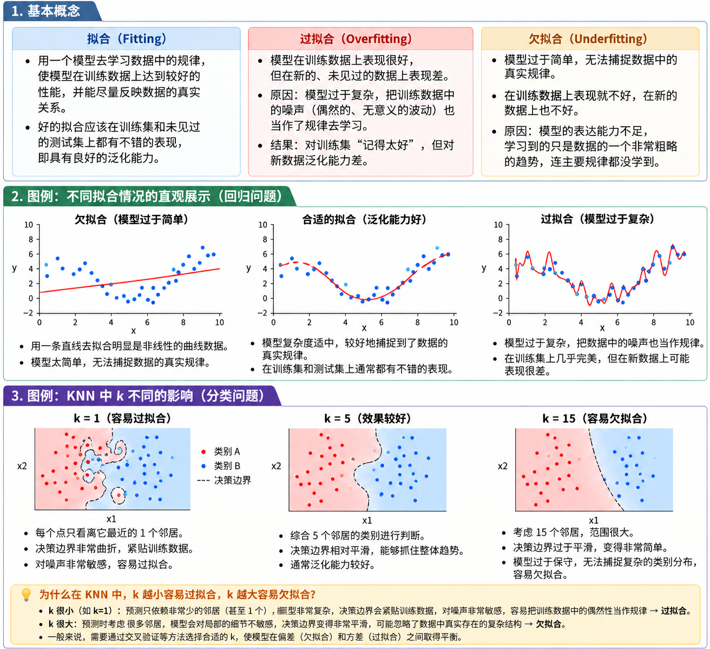
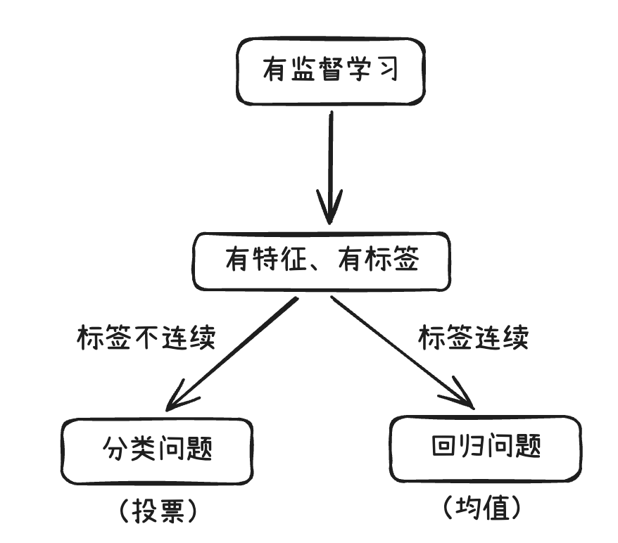
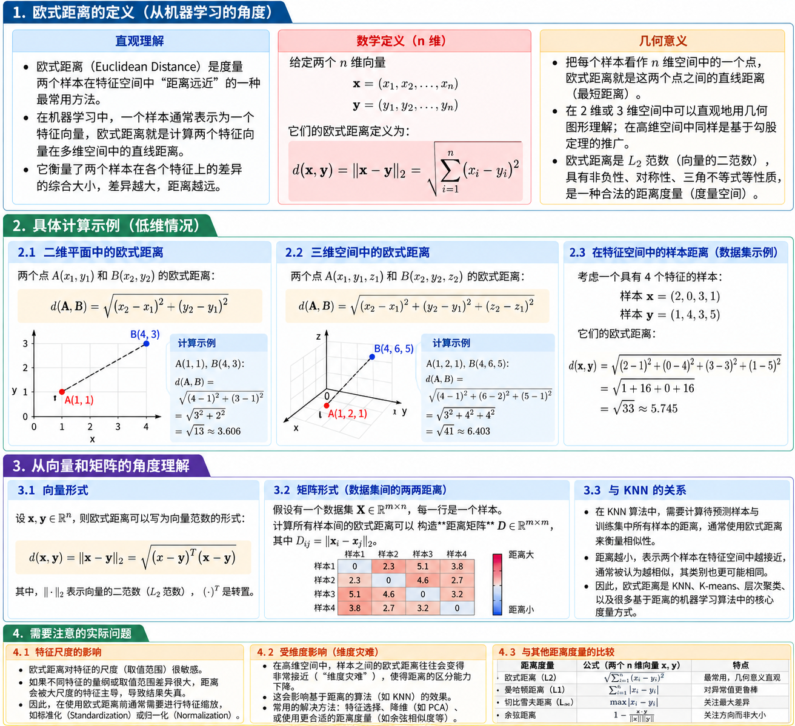

## 1 KNN算法简介

K-近邻算法（K Nearest Neighbor，简称KNN）

算法思想：如果一个样本在特征空间中的k个最相似的样本中的大多数属于某一个类别，则该样本也属于这个类别？

---

> 思考：如何确定样本的相似性?
>
> 答：通过**距离**。常见的计算距离的方式是欧式距离
>
> K-近邻算法计算样本相似性：样本都属于一个任务数据集的，样本距离越近则越相似。
>
> *欧式距离 = 对应维度差值平方和，开平方根。（可以类比勾股定理）

> 思考：k值的选择会有什么影响？
>
> 答：k值越小，属于过拟合。因为k值越小说明数据量少，导致模型学到大量的脏数据，从而模型会变得复杂。
>
> k值越大，属于欠拟合，k值的增大就意味着模型变得简单。

> 思考：那如何对K超参数进行调优？也就是如何找到最合适的K值？
> 答：交叉验证、网格搜索。



- 解决问题：分类问题、回归问题
- 算法思想：若一个样本在特征空间中的K个最相似的样本大多数属于某一个类别，则该样本也属于这个类别。
- 相似性：欧式距离



**分类流程**

1、计算位置样本到每一个训练样本的距离

2、将训练样本根据距离大小升序排列

3、取出距离最近的K个训练样本

4、进行多数表决，统计K个样本中那个类别的样本个数最多

5、将未知的样本归属到出现次数最多的类别

**回归流程**

1、计算位置样本到每一个训练样本的距离

2、将训练样本根据距离大小升序排列

3、取出距离最近的K个训练样本

4、把这个K个样本的目标值计算其平均值

5、作为将未知的样本预测的值

## 2 KNN算法API

- KNN算法分类API

```python
# 导包
from sklearn.neighbors import KNeighborsClassifier

# 准备测试集和训练集
x_train = [[0],[1],[2],[3]]
y_train = [0,0,1,1]
x_test = [[5]]

# 创建模型对象
estimator = KNeighborsClassifier(n_neighbors=2) # estimator = model

# 模型训练
estimator.fit(x_train,y_train)

# 模型预测
y_pred = estimator.predict(x_test)

print(f'预测值:{y_pred}')
```

- KNN算法回归API

```python
# 导包
from sklearn.neighbors import KNeighborsRegressor

# 准备测试集和训练集
x_train = [[0,0,1],[1,1,0],[3,10,10],[4,11,12]]
y_train = [0.1,0.2,0.3,0.4]
x_test = [[3,11,10]]

# 创建模型对象
estimator = KNeighborsRegressor(n_neighbors=2) # estimator = model

# 模型训练
estimator.fit(x_train,y_train)

# 模型预测
y_pred = estimator.predict(x_test)

print(y_pred)
```

## 3 距离度量（相似度度量）

- 欧式距离（Euclidean Distance）是最常见的“样本相似度/差异度”度量之一。它本质上来自欧几里得几何：**两点之间的直线距离**。

设两个样本分别是

```text
\mathbf{x}=(x_1,x_2,\dots,x_n),\qquad
\mathbf{y}=(y_1,y_2,\dots,y_n)
```

它们在 (n) 维特征空间中的欧式距离定义为：

```text
\sqrt{\sum_{i=1}^{n}(x_i-y_i)^2}
```

也可以写成向量形式：

```text
|\mathbf{x}-\mathbf{y}|_2
```

这里的 ‖·‖₂ 就是 **L2 范数**。



---

- 曼哈顿距离（城市街区距离）

简单理解，曼哈顿距离 = 对应维度差值的绝对值，求和。曼哈顿距离计算的是沿各个坐标轴方向移动时所经过的总距离

设两个n维样本：

```text
\mathbf{x}=(x_1,x_2,\dots,x_n)、
\mathbf{y}=(y_1,y_2,\dots,y_n)
```

那么它们之间的曼哈顿距离定义为：

```text
{
d(\mathbf{x},\mathbf{y})
\sum_{i=1}^{n}|x_i-y_i|
}
```

展开以后就是：

```text
{
d(\mathbf{x},\mathbf{y})
|x_1-y_1|

+

|x_2-y_2|

+

\cdots

+

|x_n-y_n|

}
```

从向量范数的角度，也可以写成：

```text
{
d(\mathbf{x},\mathbf{y})
\|\mathbf{x}-\mathbf{y}\|_1

}
```

这里的：

```text
\|\cdot\|_1
```

称为 **L1 范数（L1 Norm）**。

---

- 切比雪夫距离

两个样本之间的距离，不看所有维度差异的总和，而只看“差异最大的那个维度”。即对应维度的差值的绝对值，求最大值。

设两个 (n) 维样本：

```text
\mathbf{x}=(x_1,x_2,\dots,x_n)、\mathbf{y}=(y_1,y_2,\dots,y_n)
```

它们之间的切比雪夫距离定义为：

```text
\max_{1\le i\le n}|x_i-y_i|
```

也就是说：

> 分别计算两个样本在每一个特征维度上的差异，然后取其中最大的那个差异。

它也叫：

```text
{L_\infty\text{ Distance}}
```

或者：

```text
{L_\infty\text{ Norm Distance}}
```

---

- 闵可夫斯基距离（闵氏距离）

**曼哈顿距离、欧式距离、切比雪夫距离，其实都可以统一放进闵可夫斯基距离这个框架里**

设两个 (n) 维样本：

```text
\mathbf{x}=(x_1,x_2,\dots,x_n)、
\mathbf{y}=(y_1,y_2,\dots,y_n)
```

```text
{\left(
\sum_{i=1}^{n}|x_i-y_i|^p
\right)^{1/p}
}
```

其中， p ≥ 1。

## 4 特征预处理

> 为什么做归一化和标准化？
> 答：特征的单位（量纲）或者大小相差较大，或者某特征的方差相比其他的特征要大出几个数量级，容易影响（支配）目标结果，使得一些模型（算法）无法学习到其他的特征。

### 归一化

**把不同量纲、不同数值范围的特征，压缩到一个相近的尺度上，从而避免某些特征仅仅因为数值大，就在模型中占据过大的影响。**通过原始数据进行变换把数据映射到【min，max】默认为【0，1】之间

```text
x'=\frac{x-x_{\min}}{x_{\max}-x_{\min}}
```

归一化后常见的范围：

```text
x'\in[0,1]
```

范围有可能并不一定设置在（0，1）可以由公式 x'' = x' × (x_max - x_min) + x_min 来变换其范围。归一化存在弊端，容易受到最大值和最小值的影响，故一般用于小数据集。

### 标准化

把不同尺度的特征转换到统一尺度，使特征通常具有均值 0、标准差 1，避免数值范围大的特征对模型产生不合理的主导作用。

```text
z=\frac{x-\mu}{\sigma}
```

其中： x：原始数据；μ：该特征的均值；σ：该特征的标准差；z：标准化后的数据

方差计算公式如下：

```text
\sigma^2 = \frac{1}{N}\sum_{i=1}^{N}(x_i-\mu)^2
```

均值计算公式如下：

```text
\mu = \frac{1}{N}\sum_{i=1}^{N}x_i
```

标准差计算公式如下：

```text
\sigma = \sqrt{\frac{1}{N}\sum_{i=1}^{N}(x_i-\mu)^2}
```

## 5 超参数选择方法

### 交叉验证

是一种数据集的分割方法，将训练集划分为n份，拿一份做验证集（测试集）、其他的份数作为训练集。即把训练数据反复切成“训练部分”和“验证部分”，多次训练和验证，再综合这些结果来评估模型。

所以交叉验证的核心思想是：

**不要只验证一次，而是让不同的数据轮流当验证集。**

最常见的是 **K 折交叉验证（K-Fold Cross Validation）**。

交叉验证最重要的原理是：**降低一次随机划分带来的偶然性。**

假设有 100 条数据，选择：

```
K = 5
```

那么把数据平均分成 5 份：

```
Fold 1
Fold 2
Fold 3
Fold 4
Fold 5
```

第一次：

```
验证集：Fold 1
训练集：Fold 2 + Fold 3 + Fold 4 + Fold 5
```

第二次：

```
验证集：Fold 2
训练集：Fold 1 + Fold 3 + Fold 4 + Fold 5
```

第三次：

```
验证集：Fold 3
训练集：其他 4 份
```

一直做到第 5 次。

这样每一份数据：

- 都当过一次验证集
- 都当过多次训练集

最后得到 5 个验证分数：

```
score1
score2
score3
score4
score5
```

最终交叉验证分数通常取平均值：

```text
\text{CV Score}
=
\frac{1}{K}
\sum_{i=1}^{K}
\text{Score}_i
```

例如：

```
0.86
0.90
0.88
0.91
0.85
```

那么：

```text
\text{CV Score}
=
\frac{0.86+0.90+0.88+0.91+0.85}{5}
=
0.88
```

所以我们可以认为这个模型的平均验证表现大约是：

```
88%
```

---

### 网格搜索

网格搜索就是把多个超参数的候选值全部组合起来，一个一个尝试，然后通过交叉验证选出表现最好的参数组合。

比如 KNN 有两个常见超参数：

- `n_neighbors`：邻居数量k
- `p`：Minkowski 距离中的参数

假设我们设置：

```
k = [3, 5, 7]

p = [1, 2]
```

那么网格搜索会把所有组合全部尝试：

```
k=3, p=1
k=3, p=2

k=5, p=1
k=5, p=2

k=7, p=1
k=7, p=2
```

总共： 3 × 2 = 6种参数组合。

如果每一种参数组合再进行 5 折交叉验证，那么总共需要训练： 6 × 5 = 30次模型。

---

**网格搜索的基本原理**

假设一个模型有两个超参数：

```
参数 A = [a₁, a₂, a₃]

参数 B = [b₁, b₂]
```

那么参数空间可以理解为：

```
          B

        b₁       b₂

a₁    (a₁,b₁)  (a₁,b₂)

a₂    (a₂,b₁)  (a₂,b₂)

a₃    (a₃,b₁)  (a₃,b₂)
↑
A
```

Grid Search 会把这个“网格”中的每一个点全部测试一遍。

这就是“网格搜索”这个名字的来源。

---

**为什么网格搜索通常和交叉验证一起使用？**

因为如果只用一次验证集来判断哪组参数最好，结果可能具有偶然性。

所以通常采用：

```
参数组合
   ↓
K 折交叉验证
   ↓
计算平均验证分数
   ↓
比较所有参数组合
   ↓
选择表现最好的组合
```

假设：

```
k=3   → CV Accuracy = 0.86

k=5   → CV Accuracy = 0.91

k=7   → CV Accuracy = 0.89
```

那么在这些候选参数中： k=5 的平均交叉验证表现最高。

**利用KNN算法对鸢尾花分类 - 交叉验证网格搜索**

```python
from sklearn.datasets import load_iris  # 导入鸢尾花数据集
from sklearn.model_selection import train_test_split  # 导入训练集和测试集划分工具
from sklearn.model_selection import GridSearchCV  # 导入网格搜索交叉验证工具
from sklearn.preprocessing import StandardScaler  # 导入标准化工具
from sklearn.neighbors import KNeighborsClassifier  # 导入KNN分类算法
from sklearn.pipeline import Pipeline  # 导入Pipeline，用于组合数据预处理和模型
from sklearn.metrics import accuracy_score  # 导入准确率评价指标

iris = load_iris()  # 加载鸢尾花数据集
X = iris.data  # 获取样本特征数据
y = iris.target  # 获取样本对应的类别标签

X_train, X_test, y_train, y_test = train_test_split(  # 将数据划分为训练集和测试集
    X,  # 传入特征数据
    y,  # 传入标签数据
    test_size=0.2,  # 设置20%的数据作为测试集
    random_state=42,  # 设置随机种子，保证每次划分结果一致
    stratify=y  # 按类别比例进行分层抽样
)  # 完成训练集和测试集划分

pipeline = Pipeline([  # 创建机器学习Pipeline流水线
    ("scaler", StandardScaler()),  # 第一步：对每个特征进行标准化
    ("knn", KNeighborsClassifier())  # 第二步：使用KNN分类模型
])  # Pipeline定义结束

param_grid = {  # 定义网格搜索需要尝试的超参数组合
    "knn__n_neighbors": [3, 5, 7, 9, 11],  # 搜索不同的K值，即邻居数量
    "knn__weights": ["uniform", "distance"],  # 搜索普通投票和距离加权投票两种方式
    "knn__p": [1, 2]  # p=1表示曼哈顿距离，p=2表示欧式距离
}  # 参数网格定义结束

grid_search = GridSearchCV(  # 创建网格搜索交叉验证对象
    estimator=pipeline,  # 指定需要优化的模型流水线
    param_grid=param_grid,  # 指定需要搜索的超参数组合
    cv=5,  # 使用5折交叉验证
    scoring="accuracy",  # 使用分类准确率作为模型评价指标
    n_jobs=-1,  # 使用所有可用CPU核心并行计算
    verbose=1  # 输出网格搜索过程中的运行信息
)  # GridSearchCV对象创建结束

grid_search.fit(X_train, y_train)  # 在训练集上进行网格搜索和5折交叉验证

print("最佳参数：", grid_search.best_params_)  # 输出平均交叉验证成绩最好的参数组合
print("最佳交叉验证准确率：", grid_search.best_score_)  # 输出最佳参数对应的平均交叉验证准确率

best_model = grid_search.best_estimator_  # 获取网格搜索得到的最佳完整模型

y_pred = best_model.predict(X_test)  # 使用最佳模型预测测试集数据

test_accuracy = accuracy_score(y_test, y_pred)  # 计算最佳模型在测试集上的准确率

print("测试集准确率：", test_accuracy)  # 输出模型最终在测试集上的准确率
```
